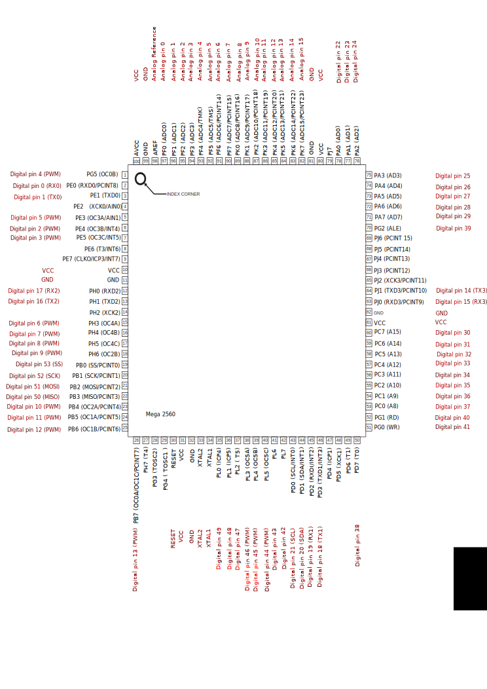
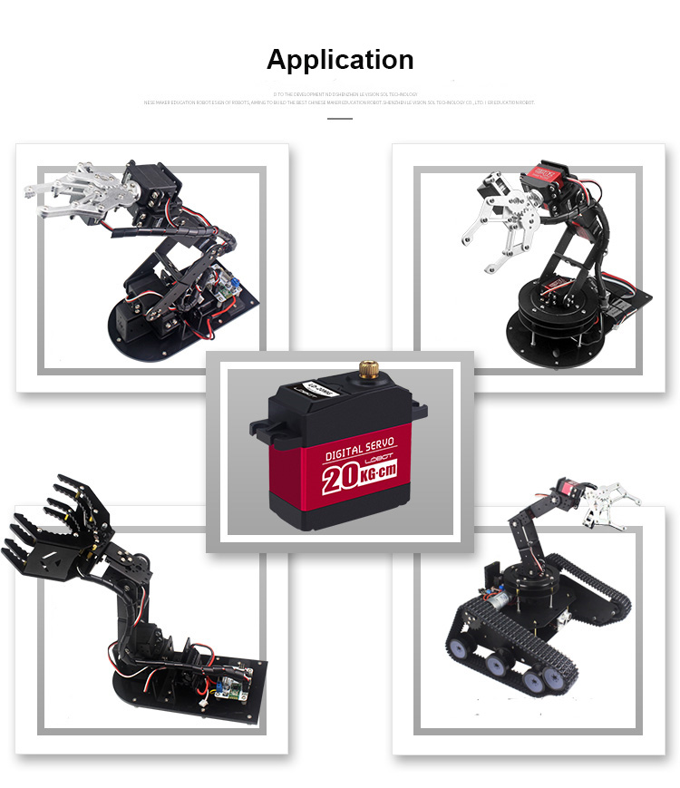

# Aurduino Notes

[TOC]

## [PWM Control](https://www.arduino.cc/en/Tutorial/SecretsOfArduinoPWM)

## Micro Controller

#### [Arduino MEGA 2560](https://store.arduino.cc/usa/mega-2560-r3)

###### Pin Mapping

Below is the pin mapping for the Atmega2560. The chip used in Arduino 2560. There are pin mappings to [Atmega8](https://www.arduino.cc/en/Hacking/PinMapping) and [Atmega 168/328](https://www.arduino.cc/en/Hacking/PinMapping168) as well.

Arduino Mega 2560 PIN diagram

Arduino Mega 2560 PIN mapping table

| Pin Number | Pin Name                 | Mapped Pin Name          |
| ---------- | ------------------------ | ------------------------ |
| 1          | PG5 ( OC0B )             | Digital pin 4 (PWM)      |
| 2          | PE0 ( RXD0/PCINT8 )      | Digital pin 0 (RX0)      |
| 3          | PE1 ( TXD0 )             | Digital pin 1 (TX0)      |
| 4          | PE2 ( XCK0/AIN0 )        |                          |
| 5          | PE3 ( OC3A/AIN1 )        | Digital pin 5 (PWM)      |
| 6          | PE4 ( OC3B/INT4 )        | Digital pin 2 (PWM)      |
| 7          | PE5 ( OC3C/INT5 )        | Digital pin 3 (PWM)      |
| 8          | PE6 ( T3/INT6 )          |                          |
| 9          | PE7 ( CLKO/ICP3/INT7 )   |                          |
| 10         | VCC                      | VCC                      |
| 11         | GND                      | GND                      |
| 12         | PH0 ( RXD2 )             | Digital pin 17 (RX2)     |
| 13         | PH1 ( TXD2 )             | Digital pin 16 (TX2)     |
| 14         | PH2 ( XCK2 )             |                          |
| 15         | PH3 ( OC4A )             | Digital pin 6 (PWM)      |
| 16         | PH4 ( OC4B )             | Digital pin 7 (PWM)      |
| 17         | PH5 ( OC4C )             | Digital pin 8 (PWM)      |
| 18         | PH6 ( OC2B )             | Digital pin 9 (PWM)      |
| 19         | PB0 ( SS/PCINT0 )        | Digital pin 53 (SS)      |
| 20         | PB1 ( SCK/PCINT1 )       | Digital pin 52 (SCK)     |
| 21         | PB2 ( MOSI/PCINT2 )      | Digital pin 51 (MOSI)    |
| 22         | PB3 ( MISO/PCINT3 )      | Digital pin 50 (MISO)    |
| 23         | PB4 ( OC2A/PCINT4 )      | Digital pin 10 (PWM)     |
| 24         | PB5 ( OC1A/PCINT5 )      | Digital pin 11 (PWM)     |
| 25         | PB6 ( OC1B/PCINT6 )      | Digital pin 12 (PWM)     |
| 26         | PB7 ( OC0A/OC1C/PCINT7 ) | Digital pin 13 (PWM)     |
| 27         | PH7 ( T4 )               |                          |
| 28         | PG3 ( TOSC2 )            |                          |
| 29         | PG4 ( TOSC1 )            |                          |
| 30         | RESET                    | RESET                    |
| 31         | VCC                      | VCC                      |
| 32         | GND                      | GND                      |
| 33         | XTAL2                    | XTAL2                    |
| 34         | XTAL1                    | XTAL1                    |
| 35         | PL0 ( ICP4 )             | Digital pin 49           |
| 36         | PL1 ( ICP5 )             | Digital pin 48           |
| 37         | PL2 ( T5 )               | Digital pin 47           |
| **38**     | **PL3 ( OC5A )**         | **Digital pin 46 (PWM)** |
| **39**     | **PL4 ( OC5B )**         | **Digital pin 45 (PWM)** |
| **40**     | **PL5 ( OC5C )**         | **Digital pin 44 (PWM)** |
| 41         | PL6                      | Digital pin 43           |
| 42         | PL7                      | Digital pin 42           |
| 43         | PD0 ( SCL/INT0 )         | Digital pin 21 (SCL)     |
| 44         | PD1 ( SDA/INT1 )         | Digital pin 20 (SDA)     |
| 45         | PD2 ( RXDI/INT2 )        | Digital pin 19 (RX1)     |
| 46         | PD3 ( TXD1/INT3 )        | Digital pin 18 (TX1)     |
| 47         | PD4 ( ICP1 )             |                          |
| 48         | PD5 ( XCK1 )             |                          |
| 49         | PD6 ( T1 )               |                          |
| 50         | PD7 ( T0 )               | Digital pin 38           |
| 51         | PG0 ( WR )               | Digital pin 41           |
| 52         | PG1 ( RD )               | Digital pin 40           |
| 53         | PC0 ( A8 )               | Digital pin 37           |
| 54         | PC1 ( A9 )               | Digital pin 36           |
| 55         | PC2 ( A10 )              | Digital pin 35           |
| 56         | PC3 ( A11 )              | Digital pin 34           |
| 57         | PC4 ( A12 )              | Digital pin 33           |
| 58         | PC5 ( A13 )              | Digital pin 32           |
| 59         | PC6 ( A14 )              | Digital pin 31           |
| 60         | PC7 ( A15 )              | Digital pin 30           |
| 61         | VCC                      | VCC                      |
| 62         | GND                      | GND                      |
| 63         | PJ0 ( RXD3/PCINT9 )      | Digital pin 15 (RX3)     |
| 64         | PJ1 ( TXD3/PCINT10 )     | Digital pin 14 (TX3)     |
| 65         | PJ2 ( XCK3/PCINT11 )     |                          |
| 66         | PJ3 ( PCINT12 )          |                          |
| 67         | PJ4 ( PCINT13 )          |                          |
| 68         | PJ5 ( PCINT14 )          |                          |
| 69         | PJ6 ( PCINT 15 )         |                          |
| 70         | PG2 ( ALE )              | Digital pin 39           |
| 71         | PA7 ( AD7 )              | Digital pin 29           |
| 72         | PA6 ( AD6 )              | Digital pin 28           |
| 73         | PA5 ( AD5 )              | Digital pin 27           |
| 74         | PA4 ( AD4 )              | Digital pin 26           |
| 75         | PA3 ( AD3 )              | Digital pin 25           |
| 76         | PA2 ( AD2 )              | Digital pin 24           |
| 77         | PA1 ( AD1 )              | Digital pin 23           |
| 78         | PA0 ( AD0 )              | Digital pin 22           |
| 79         | PJ7                      |                          |
| 80         | VCC                      | VCC                      |
| 81         | GND                      | GND                      |
| 82         | PK7 ( ADC15/PCINT23 )    | Analog pin 15            |
| 83         | PK6 ( ADC14/PCINT22 )    | Analog pin 14            |
| 84         | PK5 ( ADC13/PCINT21 )    | Analog pin 13            |
| 85         | PK4 ( ADC12/PCINT20 )    | Analog pin 12            |
| 86         | PK3 ( ADC11/PCINT19 )    | Analog pin 11            |
| 87         | PK2 ( ADC10/PCINT18 )    | Analog pin 10            |
| 88         | PK1 ( ADC9/PCINT17 )     | Analog pin 9             |
| 89         | PK0 ( ADC8/PCINT16 )     | Analog pin 8             |
| 90         | PF7 ( ADC7 )             | Analog pin 7             |
| 91         | PF6 ( ADC6 )             | Analog pin 6             |
| 92         | PF5 ( ADC5/TMS )         | Analog pin 5             |
| 93         | PF4 ( ADC4/TMK )         | Analog pin 4             |
| 94         | PF3 ( ADC3 )             | Analog pin 3             |
| 95         | PF2 ( ADC2 )             | Analog pin 2             |
| 96         | PF1 ( ADC1 )             | Analog pin 1             |
| 97         | PF0 ( ADC0 )             | Analog pin 0             |
| 98         | AREF                     | Analog Reference         |
| 99         | GND                      | GND                      |
| 100        | AVCC                     | VCC                      |

## Servo

#### [LoBot LD-20MG](https://www.rmigo.com/shop/robot-kits/servos/lobot-ld-20mg-all-metal-gear-standard-digital-servo/)

**Key Features:**

- 20kg High torque. 20kg·cm (277.6 oz·in) @6.6V
- Full metal gear, accuracy and service life are greatly increased
- Aluminium Case. Enhance the heat dissipation, ensure the servo motor to work well
- Using high-precision potentiometer with new design. Accuracy and linearity are improved much more. Accurate movement can satisfy the needs of making robots.
- 180 degree rotation. Controllable angle from 0 to 180 degrees, Excellent linearity, precision control. Able to be rotated within 360 degrees after power off

**Specifications:**

- Weight: 65g(2.32OZ)
- Dimension: 40*20*40.5mm(1.57*0.78*1.59inch)
- Speed: 0.16sec/60°(7.4V)
- Torque: 20 kg·cm (277.6 oz·in) @6.6V
- Working Voltage: 6-7.4V
- Min Working Current: 1A(Our servo needs a larger current than other servo)
- No-Load Current: 100mA
- Spline: 25T(6mm in diameter)
- Servo cable: 30cm(11.8inch) in length

**Control Specifications:** 、

- Control Method: PWM
- Pulse Width: 500~2500
- Duty Ratio: 0.5ms~2.5ms
- Pulse Period: 20ms

Please make sure that the duty cycle of the controller you are using conform to our specifications, otherwise the servo can’t turn up to claimed degree.

**Wire Layout:**

- Red Wire: +
- Black Wire: GND
- White Wire: PWM/Signal

**What’s in the package:**

- Digital servo x1
- Servo horn kit x1 (as shown in the figure)

**Note:**

Please be sure to avoid locked-rotor when using servo, locked-rotor means that artificially or machine obstructs the servo to rotate normally, the locked-rotor will lead to internal current increased to more than 7 times and the temperature increases, servo will burn out.

**Important:**

1. Connect GND is necessary.
2. It’s recommended that use lithium polymer battery with high rate discharge (min 5C), please don’t use dry battery.
3. Please use a short and thick power cord, don’t use Dupont cord.
4. Not compatible for Redcat thunder drift RC car, not compatible for 1/16 scale car.

---

==**NOTE**==

The position control, rather angle control was based on the pulse width control of the PWM onto the white wire.

The pulse period was 20ms.

The pulse width (high voltage) should be in the range of 0.5 ~ 2.5 $ms$, which can be mapped to the angle from 0° ~ 180°. As a result, the duty ratio should be in the range of $2.5\%$ ~ $12.5\%$. The duty ratio in the center should be $7.5\%$.

This might be a litter bit confusing, since a continuous PWM wave will be control the servo to be locked, and only by changing the duty ratio the engine will be moving to another position(angle).

==**_ATTENTION_**==

When wiring, make sure the ground is correctly connected. The power source and the board generating PWM signal should be co-connected. Otherwise, the servo won't be working properly.

---

#### [LX-224HV](https://www.hiwonder.hk/products/hiwonder-lx-224-hv-three-connectors-bus-servo)

Hiwonder LX-224 three channels bus high voltage servo is a serial bus servo with three connectors. Compared with the traditional 7.4v servo, the 11.1V high-voltage servo can reduce the current by more than 60%. The servo can also be connected in series, simplifying the wire connection.

**Feature**

- Use serial bus servo connector to connect the servo one by one, beautify the looking and facilitate the wiring.
- The internal high accuracy potentiometer can receive angle feedback of the robot.
- High voltage servo significantly reduces the power needs and increases the service time of servo.
- Use high-precision potentiometer to feedback the angle position.
- Equipped with position/temperature/voltage feedback, protect the servo from burning.
- Support two working mode: Servo mode ( rotation range: 0-240) and Gear motor mode ( rotation range: 0-360).
- Use metal gear to extend the service time.
- Fixed double-shaft drives the rotation of the bracket and maintains the stability of robot joints.

| Item            | Specification                                      |
| --------------- | -------------------------------------------------- |
| Weight          | 60g                                                |
| Dimension       | 39.82mm*20.09mm*51.10mm(1.57inch*0.8inch*2.02inch) |
| Speed           | 0.18sec/60°(11.1V)                                 |
| Accuracy        | 0.24°                                              |
| Torque          | 20kg.cm/11.1V                                      |
| Nominal Voltage | 11.1V                                              |
| Working Voltage | 9-12V                                              |
| Default Wire    | 20cm(7.9inch) in length                            |

---

==**_ATTENTION_**==

When used with Arduino Mega 2560 & [the debugging board](https://www.hiwonder.hk/products/hiwonder-ttl-usb-debugging-board), code uploading might fail.

Breaking the connection of serial pin between Mega and debugging board is the solution.

---
